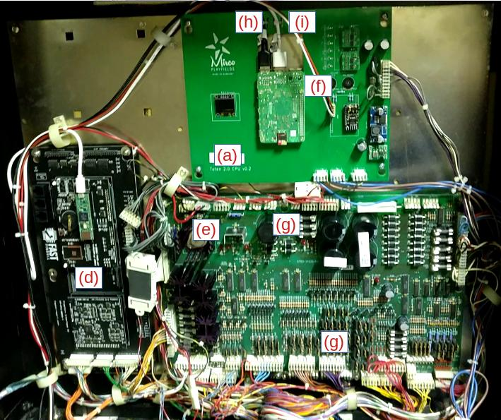
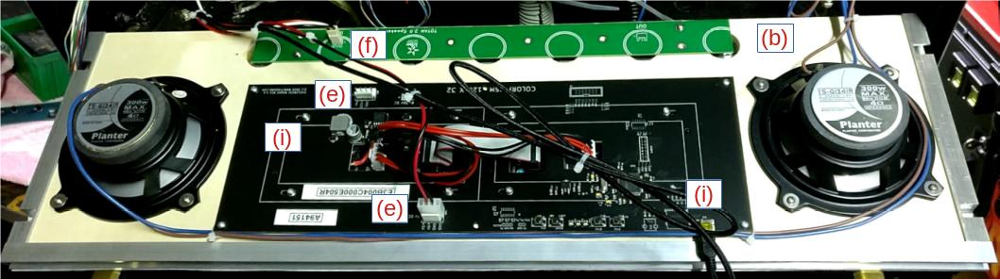
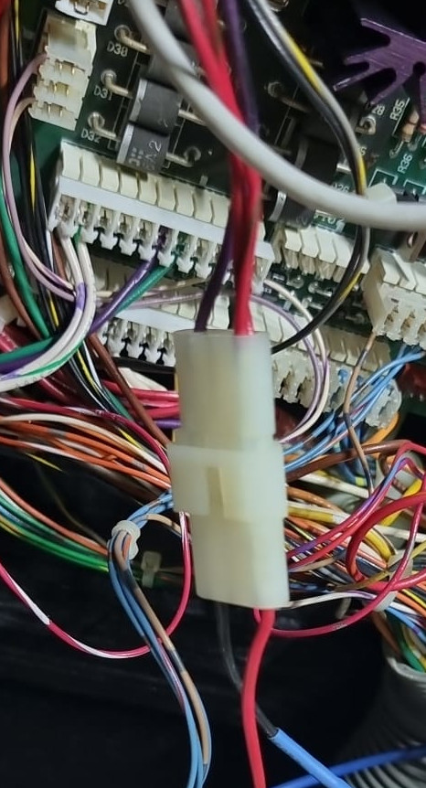

# Tales of the Arabian Nights 2.0 – The Forgotten Tales (v1/v2)

## Content of the Box

* (a) CPU + Sound Board
* (b) Speaker Panel with Stereo 2-Way Speakers, RGB DMD and 7 RGB LEDs
* (c) New Subwoofer
* (d) WPC Controller
* (e) Power Cable for DMD
* (f) Cable for RGB LEDs
* (g) Autolauncher with Cable
* (h) Micro USB Cable for WPC Controller
* (i) Mini USB Cable for DMD
* (j) Zip Ties
* (k) New Score Cards
* (l) SD Card Reader

## Notes

* Installation should take about 1h
* If unsure about any step please contact us at: mircoplayfields@gmail.com (TODO: add new email here)
* All connectors should fit and match. If they do not fit or match please do not turn on the machine and contact us instead.

## Installation

 1. Remove CPU board and Sound board from the backbox of your machine
 2. Remove the speaker panel completely (and disconnect all cables)
 3. Install new Speaker panel
 4. Install FAST Retro controller to the bottom left in the backbox (into existing mounting holes)
 5. Reconnect WPC ribbon cable
 6. Reconnect power connector to the FAST Retro controller
 7. Install CPU board on the top of the backbox (into existing mounting holes)
 8. Reconnect power connector from the right to the CPU board
 9. Connect Micro USB cable from CPU board to FAST Retro controller controller (USB port is on the left on newer FAST Retro Board revisions). Ziptie the cable at the CPU on top.
10. Connect DMD Power Cable from `J140` on the top of the power driver board to the DMD. Cable should be routed on the left of the backbox.
11. Connect RGB LED Cable from the CPU board (v1/v2 right of the CPU) to the Speaker Panel `IN`. Important: This cable needs to be routed around the left of the backbox and CANNOT be near the speaker cables (or LEDs will flicker).
12. Connect Speakers to the CPU board (two connectors in v1/v2; one connector in v3+)
13. Reconnect Subwoofer to CPU board
14. Optional: Unscrew original subwoofer and disconnect cable. Mount new subwoofer and connect original cable.
15. Connect Mini USB Cable between CPU Board (any USB) and DMD (v1: top right; v2: middle left). Ziptie the cable at both sides.
16. Unscrew the launcher switch on your playfield.
17. Disconnect knocker in the backbox (Molex 03-06-1023 connector)
    
18. Screw-in Autolauncher mech to your playfield. Connect wires from the original switch (or use old switch). Connect autolauncher at `J135` and `J117` at the driver board (top and bottom). Ziptie/Secure cable in the cabinet.
19. Install new score cards into your apron.